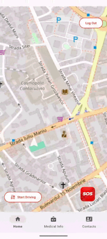
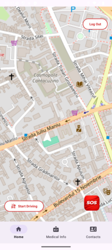
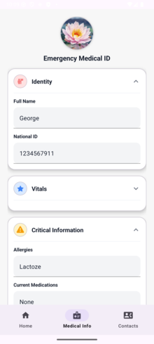
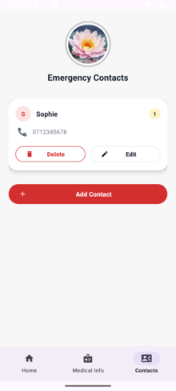

# 🚑 Emergency Response Android App


A comprehensive safety application designed to detect vehicle accidents via hardware sensors and coordinate emergency response simulations. Built with **Native Kotlin**, utilizing a **Serverless Architecture**, and deployed via a fully automated **CI/CD pipeline**.

---

## 📱 App Demo

<div align="center">

  <table>
    <tr>
        <th align="center">Ambulance Simulation</th>
    </tr>
    <tr>
        <td align="center"></td>
    </tr>
  </table>

  <table>
    <tr>
      <th align="center">Home</th>
      <th align="center">Medical Info</th>
      <th align="center">Emergency Contacts</th>
    </tr>
    <tr>
      <td align="center"></td>
      <td align="center"></td>
      <td align="center"></td>
    </tr>
  </table>

</div>

---

## 🚀 Key Features

*   **Automated Crash Detection:** Monitors G-Force using the device accelerometer (Foreground Service) to trigger an SOS when specific impact thresholds are met.
*   **Real-Time Ambulance Simulation:** Visualizes emergency response on a map using complex pathfinding algorithms.
*   **Smart Routing:** Calculates real-world driving routes from the nearest hospital using **OSRM** (Open Source Routing Machine).
*   **Cloud Synchronization:** Instantly syncs Medical Info and Emergency Contacts across devices using **Cloud Firestore**.
*   **Panic Mode:** "Dead man's switch" UI with countdown, haptic feedback, and text-to-speech guidance.

---

## 🛠 Technical Architecture

This project follows the **MVVM (Model-View-ViewModel)** architectural pattern to ensure separation of concerns and testability.

### 🏗️ Tech Stack
*   **Language:** Kotlin
*   **UI:** XML Layouts with ViewBinding
*   **Backend:** Firebase (Authentication, Firestore NoSQL Database)
*   **Maps & Location:** OpenStreetMap (OSMDroid), OSMBonusPack, Google Play Location Services
*   **Concurrency:** Kotlin Coroutines & Flow
*   **Dependency Injection:** Manual DI / ViewModelFactory

### ⚙️ DevOps & CI/CD
I engineered a complete CI/CD pipeline using **GitHub Actions**:
1.  **Continuous Integration:** Automatically compiles code and runs Lint/Unit tests on every push.
2.  **Secret Injection:** Sensitive keys (API Tokens, `google-services.json`) are injected dynamically during the build process from GitHub Secrets.
3.  **Continuous Delivery:** Successfully built APKs are automatically uploaded to **Firebase App Distribution**, notifying the QA team via email.

---

## 🧮 Algorithmic Highlight: Vector Interpolation

One of the core challenges was animating the ambulance smoothly along a curved geographic path while maintaining correct orientation.

Instead of simple point-to-point movement, I implemented a **Tangent Vector Calculation**:

1.  **Pathfinding:** Retrieved road nodes $(P_0, P_1, ... P_n)$ via OSRM.
2.  **Look-Ahead Logic:** To prevent "jitter" from noisy GPS data, the algorithm calculates the bearing based on a look-ahead distance of 15 meters.
3.  **Rotation Matrix:**
    The bearing $\theta$ (compass direction) is calculated as the angle between the current position $P_t$ and the target $P_{t+\Delta}$ relative to North.

    ```kotlin
    // Simplified logic snippet
    val bearing = currentPoint.bearingTo(nextPoint).toFloat()
    ambulanceMarker.rotation = bearing // Aligns vector with road tangent
    ```

This results in a vehicle simulation that naturally "steers" through corners rather than snapping to angles.

---

## 🔧 Setup & Installation

To run this project locally, you must configure the environment secrets.

1.  **Clone the repo:**
    ```bash
    git clone https://github.com/grozeageorge/emergency-app.git
    ```
2.  **Firebase Config:**
    *   This project relies on `google-services.json` which is git-ignored for security.
    *   You must place your own `google-services.json` inside the `app/` directory.
3.  **Build:**
    *   Open in Android Studio.
    *   Sync Gradle.
    *   Run on Emulator/Device.

---

## 🤝 Contributors

*   **Grozea George** - *Team Leader & System Integrator*
    *   Established the **CI/CD Pipeline** (GitHub Actions).
    *   Implemented the **Map Simulation** & Pathfinding algorithms.
    *   Managed the **Firebase/Firestore** backend connectivity.

*   **Bardas Denis** - *Sensor & Medical Logic*
    *   Implemented the **Emergency Countdown** mechanism.
    *   Developed the **Medical Information** module.
    *   Handled accelerometer sensor integration.

*   **Manea Horia** - *Contacts & Media*
    *   Developed the **Emergency Contacts** management system.
    *   Implemented Local **Profile Photo** persistence.
    *   Contributed to app styling and layout.

*   **Montejano Eva** - *Authentication & Design*
    *   Implemented **Login & Registration** flows.
    *   Designed the core **UI/UX** theme and assets.
    *   Managed navigation structure.
